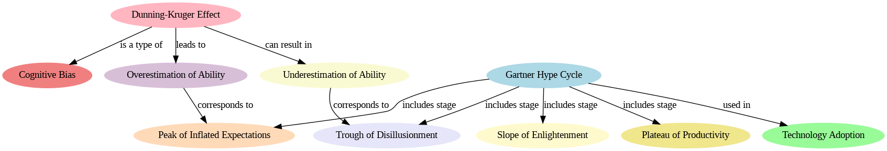

# Knowledge Graph Generator

This repo contains a simplified script based on a Flask app found in [this repo](https://github.com/MananSuri27/ArticleKnowledgeGraph).

> [!NOTE]
> You will need to enter your OpenAI API key where indicated in the script/notebook in order to generate the output as shown.

OpenAI's API is leveraged along with Python's GraphViz library to take a prompt (i.e., "The Dunning-Kruger Effect as it relates to the Gartner Hype Cycle") and generate an output such as that seen below:

